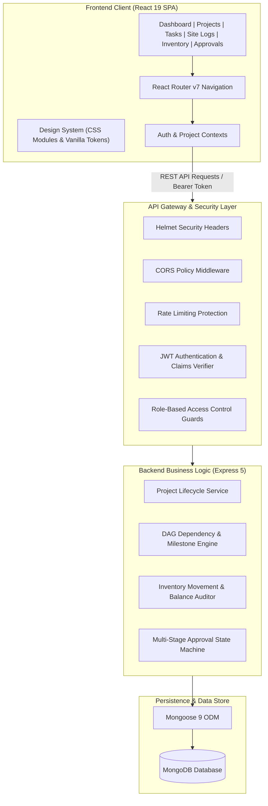

# BUILDORA — Enterprise Construction Operations & Resource Management

[](https://react.dev/)
[](https://vitejs.dev/)
[](https://expressjs.com/)
[](https://www.mongodb.com/)
[](https://nodejs.org/)
[](LICENSE)

**BUILDORA** is an enterprise-grade SaaS platform engineered specifically for general contractors, construction project management offices (PMOs), site supervisors, and procurement teams. It digitizes the entire lifecycle of capital construction projects — replacing fragmented spreadsheets, paper site diaries, and untracked messaging threads with a single source of truth.

From high-level portfolio budget utilization down to daily concrete batch allocations and critical-path task dependencies, BUILDORA provides real-time operational traceability and governance.

---

## Table of Contents

- [Platform Overview](#platform-overview)
- [System Architecture](#system-architecture)
- [Core Functional Modules](#core-functional-modules)
  - [1. Executive Telemetry & Dashboard](#1-executive-telemetry--dashboard)
  - [2. Projects Portfolio Ledger](#2-projects-portfolio-ledger)
  - [3. Tasks & Milestones Engine](#3-tasks--milestones-engine)
  - [4. Site Operations & Daily Logs](#4-site-operations--daily-logs)
  - [5. Issues & Quality Assurance (QA)](#5-issues--quality-assurance-qa)
  - [6. Materials Catalog & Specification](#6-materials-catalog--specification)
  - [7. Inventory & Warehouse Stock Control](#7-inventory--warehouse-stock-control)
  - [8. Approvals & Requisition Governance](#8-approvals--requisition-governance)
  - [9. Enterprise Showcase & Landing](#9-enterprise-showcase--landing)
- [Role-Based Access Control (RBAC)](#role-based-access-control-rbac)
- [Technology Stack](#technology-stack)
- [REST API Specifications](#rest-api-specifications)
- [Repository Directory Structure](#repository-directory-structure)
- [Installation & Quick Start](#installation--quick-start)
- [Automated Testing Suite](#automated-testing-suite)
- [Design System & UI Aesthetics](#design-system--ui-aesthetics)
- [License](#license)

---

## Platform Overview

Commercial and residential construction operations are notoriously prone to cost overruns, schedule delays, untracked material shrinkage, and communication gaps between site field engineers and head-office project managers.

BUILDORA addresses these challenges through:

1. **Closed-Loop Workflow Integration**: An issue flagged on site can immediately trigger an inspection task, which generates a material requisition, routes it through an automated approval workflow, and adjusts warehouse stock upon delivery.
2. **Deterministic Task Dependencies**: Directed Acyclic Graph (DAG) validation prevents tasks from being closed out or initiated before prerequisite trade activities are formally certified.
3. **Real-Time Financial & Resource Guardrails**: Automatic budget variance calculations and minimum inventory safety thresholds safeguard capital allocation before purchase orders are committed.
4. **Persona-Tailored Ergonomics**: High-density desktop workspace for project controllers combined with touch-optimized, high-contrast interfaces for field personnel on tablet and mobile viewports.

---

## System Architecture

BUILDORA is designed on a decoupled, modular full-stack architecture adhering to enterprise separation of concerns:



### Architectural Principles

- **State Normalization**: Automated synchronization across milestones, parent project progress, and child task completion.
- **Defensive API Contracts**: Unified response envelopes for all responses (`{ success: true, data: ... }` / `{ success: false, message: ... }`).
- **Audit-Traceable Business Logic**: Immutability for financial journals, inventory transaction records, and approval status transitions.

---

## Core Functional Modules

### 1. Executive Telemetry & Dashboard
The executive dashboard provides an instant overview of organizational health across all active jobsites:
- **Global Project Filter**: Seamlessly toggle metrics between the entire enterprise portfolio or isolated to a specific project.
- **KPI Metrics Cards**: Live counters for Active Projects, Open Field Issues, Pending Material Approvals, and Budget Burn Utilization.
- **Visual Analytics**: Interactive Chart.js charts rendering milestone achievement curves, task status breakdowns, and monthly spend vs. budget projections.
- **Operational Timeline**: Chronological activity feed logging site report submissions, status promotions, and field incident resolutions.

### 2. Projects Portfolio Ledger
Comprehensive lifecycle management for capital works:
- **Portfolio Directory**: Filterable and searchable grid/table view by location, client, status (`Planning`, `In Progress`, `On Hold`, `Completed`), and manager.
- **Budget Tracking**: High-precision tracking of sanctioned budget versus actual incurred expenditure with automatic variance alerts.
- **Project Drawer & Modals**: Create, edit, and archive projects with metadata covering start/end dates, site address, and assigned supervisory personnel.

### 3. Tasks & Milestones Engine
A complete trade scheduling engine designed around critical path principles:
- **Compact KPI Banner**: 5 key metric indicators summarizing Total Tasks, In Progress items, Pending Review, Overdue alarms, and Critical Path activities.
- **Multi-View Operations**:
  - **Table View**: High-density tabular layout with inline priority tags, assignees, due dates, completion percentages, and overflow action menus.
  - **Kanban Board**: Drag-and-drop workflow columns (`Not Started`, `In Progress`, `Under Review`, `Completed`).
  - **Timeline / Gantt**: Horizontal visualization of project phases and schedule overlaps.
- **DAG Dependency Resolution**: Backend business rules actively reject circular dependencies (e.g., $A \rightarrow B \rightarrow A$) and prevent tasks from completing if prerequisite activities are unfinished.
- **Milestone Timeline Panel**: Dedicated milestone tracker showing target delivery dates, completion status, and associated task counts.
- **Quick Telemetry Drawer**: Live inspection sheet detailing selected task constraints, assigned workforce, and prerequisite blockers.

### 4. Site Operations & Daily Logs
Empowering field superintendents to capture authentic ground conditions:
- **Daily Site Diaries**: Log ambient weather conditions (Temperature, Precipitation, Work Impact), workforce headcounts, and active subcontractors.
- **Work Performed Summaries**: Structured descriptions of daily progress per work package (Earthwork, RCC, Masonry, MEP).
- **Incident & Safety Documentation**: Direct reporting of near-misses, safety violations, and environmental hazards with photographic attachments.

### 5. Issues & Quality Assurance (QA)
Structured field defect management and inspection tracking:
- **Severity Matrices**: Issues categorized as `Critical`, `High`, `Medium`, or `Low` with visual SLA response timers.
- **Root Cause & Trade Categorization**: Track defects across Structural, Electrical, Plumbing, HVAC, and Architectural disciplines.
- **Resolution Workflow**: Closed-loop progression from `Open` $\rightarrow$ `Investigating` $\rightarrow$ `Resolved` $\rightarrow$ `Closed` with supervisor sign-off.

### 6. Materials Catalog & Specification
A centralized master database of construction supplies:
- **Master SKU Catalog**: Complete registry of standard construction commodities (Cement, TMT Steel Rebar, Aggregate, Ready-Mix Concrete, PVC Piping, etc.).
- **Unit Precision**: Standardized metrics ($M^3$, Metric Tons, Bags, Linear Meters) and standard market rate benchmarks.
- **Preferred Supplier Registry**: Link materials to authorized vendors and lead-time schedules.

### 7. Inventory & Warehouse Stock Control
Rigorous warehouse and on-site stock accounting:
- **Real-Time Stock Balances**: Live visibility of on-hand quantities, reserved batches, and transit stock across all site yards.
- **Threshold Alerts**: Automatic `Low Stock` and `Critical Shortage` indicators when inventory dips below minimum buffer stock.
- **Audited Stock Movements**: Complete ledger of transactions:
  - `Inbound`: Goods received against purchase orders.
  - `Outbound`: Materials issued to specific project work orders and task supervisors.
  - `Adjustment`: Stock reconciliation logs for waste, damage, or audit corrections.
- **Negative Stock Prevention**: Backend integrity checks prevent material issuance exceeding verified on-hand balances.

### 8. Approvals & Requisition Governance
Multi-tier financial and material requisition control:
- **Requisition Pipeline**: Site supervisors draft material requests which route directly into the approval queue.
- **Approval State Machine**: Strict status transitions (`Pending` $\rightarrow$ `Approved` or `Rejected`). Terminal states are immutable and cannot be reverted without creating a new revision.
- **Audit Logging**: Every approval captures the approver user ID, timestamp, and optional feedback notes for executive accountability.

### 9. Enterprise Showcase & Landing
A modern, conversion-optimized public landing page:
- **Hero Presentation**: Value proposition, animated platform previews, and quick CTAs.
- **Feature Spotlights**: Interactive breakdowns of field operations, procurement, and executive intelligence.
- **Live Demo Personas**: Instant one-click authentication switcher allowing evaluators to experience the platform as a Project Manager, Site Engineer, Procurement Officer, or Client.

---

## Role-Based Access Control (RBAC)

BUILDORA enforces strict role-based access control at both the UI presentation layer and the API/controller layer:

| Resource / Capability | Project Manager | Site Engineer / Supervisor | Procurement Officer | Client / Executive |
| :--- | :---: | :---: | :---: | :---: |
| **Portfolio Dashboard & Analytics** | Full Access | Project-Scoped | Resource KPIs | View Only (KPIs) |
| **Create / Edit / Archive Projects** | ✅ Yes | ❌ No | ❌ No | ❌ No |
| **Tasks & Milestones (Manage / Assign)**| ✅ Yes | Status Updates Only | ❌ No | View Only |
| **Daily Site Reports (Submit / Edit)** | Review & Approve | ✅ Create & Submit | ❌ No | View Only |
| **Issue Tracking & QA Resolution** | Full Control | Create & Update | ❌ No | View Only |
| **Materials Catalog & Pricing** | View Only | View Only | ✅ Full Control | ❌ No |
| **Stock Movements & Issuance** | View Only | Request Issuance | ✅ Issue & Reconcile| ❌ No |
| **Requisition Approvals** | ✅ Approve | Draft Requests | Process Approved | ❌ No |
| **User & Role Administration** | ✅ Yes | ❌ No | ❌ No | ❌ No |

---

## Technology Stack

### Frontend Architecture
- **Framework**: [React 19](https://react.dev/) — Modern component-driven UI with Hooks and Context API.
- **Build Tool**: [Vite 6](https://vitejs.dev/) — High-speed Hot Module Replacement (HMR) and optimized Rollup bundling.
- **Routing**: [React Router v7](https://reactrouter.com/) — Declarative client-side routing with protected route wrappers.
- **Data Visualization**: [Chart.js 4](https://www.chartjs.org/) + [react-chartjs-2](https://react-chartjs-2.js.org/) — Responsive canvas charting for progress and financial curves.
- **Icons**: [Lucide React](https://lucide.dev/) — Consistent, light-weight enterprise iconography.
- **Motion & Micro-interactions**: [Framer Motion](https://www.framer.com/motion/) — Fluid modal transitions and drawer animations.
- **Design System**: Vanilla CSS design tokens with custom HSL variables, responsive media queries, and Tailwind CSS utility support.

### Backend & Database Architecture
- **Runtime**: [Node.js 18+](https://nodejs.org/) (ES Modules) — High-throughput asynchronous runtime.
- **Application Framework**: [Express 5](https://expressjs.com/) — Fast, unopinionated REST API layer.
- **Database & ODM**: [MongoDB](https://www.mongodb.com/) via [Mongoose 9](https://mongoosejs.com/) — Strict schema validation, typed models, and relational population.
- **Authentication**: [JSON Web Tokens (JWT)](https://jwt.io/) with encrypted stateless claims and [bcryptjs](https://github.com/dcodeIO/bcrypt.js) password hashing.
- **Security & Hardening**:
  - [Helmet](https://helmetjs.github.io/) for secure HTTP response headers.
  - [CORS](https://github.com/expressjs/cors) with configured origin whitelists.
  - [Express Rate Limit](https://github.com/express-rate-limit/express-rate-limit) to mitigate brute-force and DDoS attempts.
  - Input validation sanitizers for all incoming request payloads.

---

## REST API Specifications

The Buildora backend serves clean, predictable RESTful endpoints. All responses follow standard JSON envelopes:
- **Success**: `{ "success": true, "data": { ... } }`
- **Error**: `{ "success": false, "message": "Reason for error" }`
- **Validation Failure**: `{ "success": false, "message": "Validation failed", "errors": [ ... ] }`

### API Endpoint Directory

#### Authentication & Profile (`/api/auth`)
- `POST /api/auth/register` — Register a new platform user with designated role.
- `POST /api/auth/login` — Authenticate user and issue JWT bearer token.
- `GET /api/auth/me` — Retrieve the currently authenticated user's profile and permissions.

#### Executive Telemetry (`/api/dashboard`)
- `GET /api/dashboard/stats` — Aggregated KPI metrics, budget summaries, and site activity streams (supports `?projectId=` query parameter).

#### Projects (`/api/projects`)
- `GET /api/projects` — List all projects with optional status and search filters.
- `GET /api/projects/:id` — Retrieve detailed project dossier with linked milestones, tasks, and site reports.
- `POST /api/projects` — Create a new project *(Project Manager only)*.
- `PUT /api/projects/:id` — Update project metadata, budget, or timelines.
- `DELETE /api/projects/:id` — Soft-archive a project record.

#### Tasks & Milestones (`/api/tasks`, `/api/milestones`)
- `GET /api/tasks` — List tasks with filters for `projectId`, `status`, `priority`, and `assignee`.
- `POST /api/tasks` — Create task with assigned dependencies and scheduled dates.
- `PUT /api/tasks/:id` — Update task details, progress percentage, or completion state.
- `DELETE /api/tasks/:id` — Remove or archive a task record.
- `GET /api/milestones` — List milestones with delivery dates and associated progress.
- `POST /api/milestones` — Create a strategic milestone phase.

#### Site Operations & Field Logs (`/api/site-reports`)
- `GET /api/site-reports` — Retrieve field reports filtered by project and date range.
- `POST /api/site-reports` — Submit daily site log including weather, labor headcount, and work descriptions.
- `GET /api/site-reports/:id` — Retrieve comprehensive site diary document.

#### Issues & Defects (`/api/issues`)
- `GET /api/issues` — Query field issues filtered by project, severity, and status.
- `POST /api/issues` — File a new defect ticket with priority and assigned trade.
- `PUT /api/issues/:id` — Update issue resolution stage or close defect.

#### Materials & Inventory (`/api/materials`, `/api/inventory`, `/api/material-requests`)
- `GET /api/materials` — Retrieve master catalog of materials and unit rates.
- `POST /api/materials` — Add a new material definition *(Procurement only)*.
- `GET /api/inventory` — Query current warehouse stock balances and low-stock alerts.
- `POST /api/inventory/transaction` — Record audited material movement (`Inbound`, `Outbound`, `Adjustment`).
- `GET /api/material-requests` — List field material requisition tickets.
- `POST /api/material-requests` — Submit a new material requisition for approval.

#### Governance & Approvals (`/api/approvals`)
- `GET /api/approvals` — Retrieve pending and historic approval queue items.
- `PUT /api/approvals/:id` — Execute approval or rejection action with reviewer remarks.

#### System Health (`/api/health`)
- `GET /api/health` — Verify API server readiness and database connectivity.

---

## Repository Directory Structure

```text
buildora-construction-management/
├── backend/                        # Node.js + Express 5 Backend
│   ├── config/                     # Database & environment configurations
│   ├── controllers/                # Request handling & orchestration
│   ├── middleware/                 # JWT auth, RBAC, error handling, rate limiting
│   ├── models/                     # Mongoose 9 Data Schemas (User, Project, Task, etc.)
│   ├── routes/                     # REST API route declarations
│   ├── scripts/                    # Database seed scripts & e2e verification
│   ├── services/                   # Business rules (DAG dependencies, budget formulas)
│   ├── tests/                      # Automated test suite (30 unit & integration tests)
│   ├── validators/                 # Payload schema validation logic
│   ├── API.md                      # Detailed endpoint documentation
│   ├── app.js                      # Express application factory & middleware pipeline
│   └── server.js                   # HTTP server entrypoint
│
├── frontend/                       # React 19 + Vite Frontend SPA
│   ├── public/                     # Static assets, logos, and favicons
│   ├── src/
│   │   ├── components/
│   │   │   ├── common/             # Reusable UI primitives (Buttons, Cards, Badges)
│   │   │   ├── layout/             # Sidebar, Navbar, and AppLayout shell
│   │   │   └── modals/             # Create/Edit modals for projects, tasks, materials
│   │   ├── context/                # AuthContext & ProjectFilterContext
│   │   ├── pages/                  # Page route components
│   │   │   ├── Dashboard.jsx       # Executive telemetry & charts
│   │   │   ├── Projects.jsx        # Project portfolio ledger
│   │   │   ├── ProjectDetails.jsx  # Single project dossier
│   │   │   ├── Tasks.jsx           # Tasks & Milestones management
│   │   │   ├── SiteReports.jsx     # Daily field operations diaries
│   │   │   ├── Issues.jsx          # QA defect tracking
│   │   │   ├── Materials.jsx       # Master commodity catalog
│   │   │   ├── Inventory.jsx       # Warehouse stock control
│   │   │   ├── Approvals.jsx       # Multi-stage approval queue
│   │   │   ├── LandingPage.jsx     # Enterprise showcase & marketing
│   │   │   ├── Login.jsx           # User authentication & persona switcher
│   │   │   └── Register.jsx        # Account registration
│   │   ├── services/               # API client abstraction layer (Axios/Fetch)
│   │   ├── styles/                 # Global design system tokens & layout CSS
│   │   ├── App.jsx                 # Route definitions & layout wrappers
│   │   └── main.jsx                # Application root mounting
│   ├── index.html                  # HTML entrypoint
│   └── vite.config.js              # Vite bundling & alias configuration
│
├── .env.example                    # Environment variable template
├── package.json                    # Monorepo workspace configuration & root scripts
└── README.md                       # Comprehensive platform documentation
```

---

## Installation & Quick Start

### Prerequisites
- **Node.js**: v18.0.0 or higher
- **npm**: v9.0.0 or higher
- **MongoDB**: Local MongoDB instance (`mongodb://localhost:27017`) or [MongoDB Atlas](https://www.mongodb.com/atlas) connection URI.

### 1. Clone the Repository
```bash
git clone https://github.com/kash0607/buildora-construction-management.git
cd buildora-construction-management
```

### 2. Install Dependencies
Install dependencies across both root workspace, frontend, and backend:
```bash
npm install
```

### 3. Configure Environment Variables
Create a `.env` file in the root directory (or use `.env.example` as a template):
```env
PORT=5000
NODE_ENV=development
MONGODB_URI=mongodb://localhost:27017/buildora
JWT_SECRET=your_super_secret_jwt_key_buildora_2026
JWT_EXPIRES_IN=7d
CORS_ORIGIN=http://localhost:5173
```

### 4. Seed the Database
Populate your database with realistic construction projects, tasks, materials, inventory stock, site logs, and demo user accounts:
```bash
npm run seed
```

*Demo personas created by the seed script:*
- **Project Manager**: `kashish.pm@buildora.com` (Password: `Password123!`)
- **Site Supervisor**: `zaara.site@buildora.com` (Password: `Password123!`)
- **Procurement Officer**: `isika.procure@buildora.com` (Password: `Password123!`)

### 5. Launch the Development Environment
You can run the backend API server and frontend client concurrently:

**Start the Backend API Server:**
```bash
npm run server
# Server listening on http://localhost:5000
```
*(Optional: use `npm run server:dev` for auto-reloading with Node's native watch mode)*

**Start the Frontend Client:**
In a separate terminal:
```bash
npm run dev
# Vite client running on http://localhost:5173
```

Open `http://localhost:5173` in your browser to experience the platform.

---

## Automated Testing Suite

BUILDORA includes an automated testing suite built on Node.js's native test runner (`node --test`), verifying core business rules, security middlewares, and validation schemas:

```bash
npm run test:backend
```

### Test Coverage Highlights (30 Passing Tests)
- **API Health & Security**: Health check status, 404 handler, structured error envelope format.
- **JWT & Auth Middleware**: Token generation, verification, claims parsing, and expired token rejection.
- **Role-Based Access Control**: Role authorization guards, forbidden access isolation.
- **Project Progress Engine**: Weighted completion averages, archive task exclusion, empty state handling.
- **Budget Formulas**: Utilization rates, variance alarms, division-by-zero protection.
- **Task DAG Engine**:
  - Self-dependency rejection ($A \rightarrow A$).
  - Missing dependency detection.
  - Linear dependency verification ($A \rightarrow B \rightarrow C$).
  - Circular dependency prevention (2-node $A \rightarrow B \rightarrow A$ and 3-node $A \rightarrow B \rightarrow C \rightarrow A$).
  - Incomplete prerequisite completion blocking.
- **State Normalization**: Bidirectional sync between progress percentage ($100\%$) and `Completed` status.
- **Approval State Machine**: Transition integrity (`Pending` $\rightarrow$ `Approved`/`Rejected`, preventing regression from terminal states).
- **Inventory Balance Guards**: Stock sufficiency checks, negative balance prevention, zero/negative issue validation.
- **Input Validators**: Strict schema validation for registration, project parameters, and task creation.

---

## Design System & UI Aesthetics

BUILDORA adheres to a modern, enterprise design system crafted specifically for high-stress operational environments:

### Curated Color Palette
- **Deep Navy (`#0B1B2B`)**: Dominant corporate tone applied across navigation sidebars and headers, imparting solid authority.
- **Warm Sand (`#F7F4EE`)**: Ergonomic, off-white workspace background reducing eye fatigue during long monitoring shifts.
- **Earth Bronze (`#6B4935`)**: Distinctive accent highlighting active states, primary brand actions, and structural elements.
- **Status Accents**:
  - **Success / On Track**: Emerald Green (`#10B981`)
  - **In Progress / Active**: Industrial Amber (`#F59E0B`)
  - **Critical / Overdue**: Signal Red (`#EF4444`)
  - **Planned / Pending**: Slate Blue (`#64748B`)

### Responsive Navigation
- **Collapsible Desktop Rail**: Sidebar effortlessly toggles between full 260px expanded mode and a compact 72px icon rail for maximum data density on wide screens.
- **Mobile Drawer**: Responsive drawer on viewports $\le 768\text{px}$ ensuring seamless navigation for supervisors using tablets and phones on site.

---

## License

This project is licensed under the MIT License — see the [LICENSE](LICENSE) file for details.
